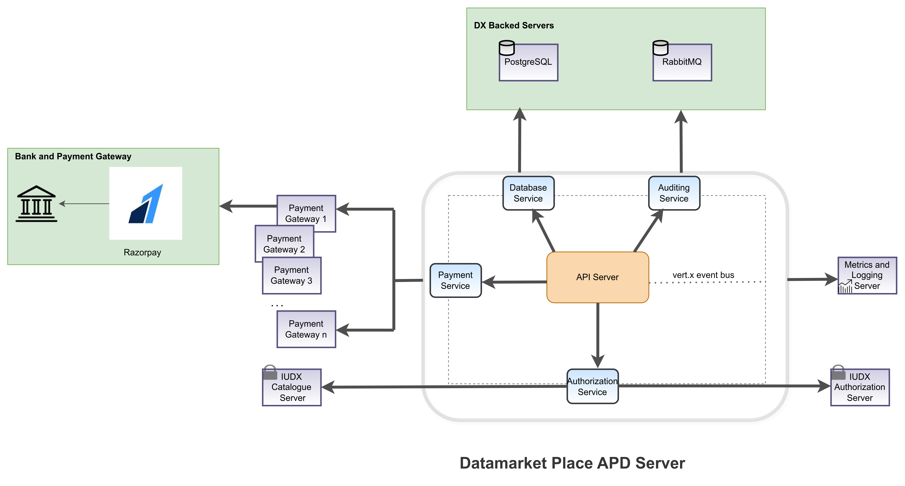

<div class="img_background">
<div style={{textAlign: 'center'}}>

<br/>

</div></div>
The data marketplace is IUDX's platform that enables data Providers to host their resources bundled as a product. Likewise, data consumers can buy the products listed by various providers. The consumers can make purchases against a product variant of the any product. Providers can receive payments through Razorpay which is implemented as the payment gateway. All users can interact with the data marketplace API server using HTTPs requests.

### Installation

1. Navigate to the directory:

    ```bash
    cd iudx-deployment/Docker-Swarm-deployment/single-node/marketplace-apd
    ```

2. The apd-server container is constrained to run on specifc node by adding node labels to only one of the nodes, refer [here](https://docs.docker.com/engine/swarm/services/#placement-constraints) for more info. This ensures the container is placed always to same node on restart.
    
    ```sh
    docker node update --label-add marketplace-node=true <node_name>
    ```
3. Make a copy of sample secrets directory.

    1. Substitute appropriate values using commands whatever mentioned in config files. Configure the secrets/.apd.env file with appropriate values in the place holders `<>`
    
    2. Secrets directory after generation of secret files
    
        ```sh
        secrets/
        ├── config.json
        └── .apd.env
        ```

4. Define Appropriate values of resources 

    - CPU 
    - RAM 
    - PID limit 
    in `dmp-apd-stack.resources.yaml` as shown in sample resource-values file for [here](example-dmp-apd-server-stack.resources.yaml)

5. Deploy APD server stack:

```sh
docker stack deploy -c marketplace-apd-stack.yaml -c dmp-apd-stack.resources.yaml dmp-apd
```

### Tests 

The apis documentation will be available at 
    `https://<dmp-apd-server-domain-name>/apis`

# Notes

1. The upstream code for dmp-apd server is available at [here](https://github.com/datakaveri/iudx-data-marketplace-apd.git).

2. If you need to expose the HTTP ports or have custom stack configuration( see [here](example-dmp-apd-server-stack.custom.yaml) for example configuration of 'dmp-apd-stack.custom.yaml' file)  and bring up like as follows.

```sh
docker stack deploy -c marketplace-apd-stack.yaml -c dmp-apd-stack.resources.yaml -c dmp-apd-stack.custom.yaml dmp-apd
```