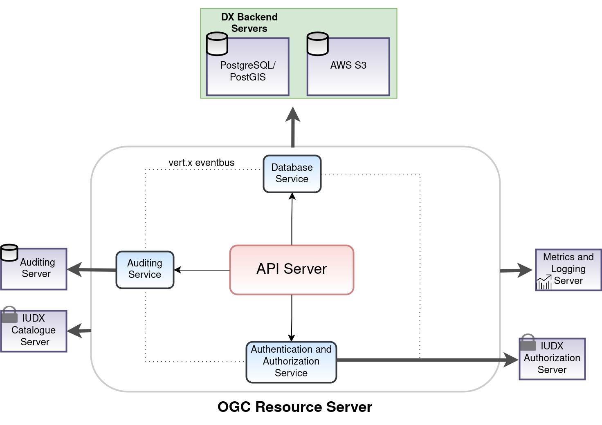

<div class="img_background">
<div style={{textAlign: 'center'}}>

<br/>

</div></div>

### Installation

1. Navigate to the directory:

    ```bash
    cd iudx-deployment/Docker-Swarm-deployment/single-node/ogc-rs/
    ```

2. Assign the node label if not assigned during swarm installation using:

    The ogc resource server container is constrained to run on specific node by adding node labels to only one of the nodes, refer [here](https://docs.docker.com/engine/swarm/services/#placement-constraints) for more info. This ensures the container is placed always to same node on restart.

    ```bash
    docker node update --label-add ogc-rs-node=true <node_name>
    ``` 
    
3. Make a copy of sample secrets directory.

    ```console
    cp -r example-secrets/secrets .
    ```

    1. Substitute appropriate values using commands whatever mentioned in config files. Configure the secrets/.ogc-rs.env file with appropriate values in the place holders `<>`

    2. Secrets directory after generation of secret files
    ```sh
    secrets/
    ├── config.json
    └── .ogc-rs.env
    ```
    

4. Define Appropriate values of resources 

    - CPU 
    - RAM 
    - PID limit 
    in `ogc-rs-stack.resources.yaml` as shown in sample resource-values file for [here](example-ogc-rs-stack.resources.yaml)

5. Deploy OGC Resource server stack:
    
    ```sh
    docker stack deploy -c ogc-rs-stack.yaml -c ogc-rs-stack.resources.yaml ogc-rs
    ```

### Tests

The apis documentation will be available at 
    `https://<ogc-resource-server-domain-name>/apis`

# Notes

1. The upstream code for ogc resource server is available at [here](https://github.com/datakaveri/ogc-resource-server.git).

2. If you need to expose the HTTP ports or have custom stack configuration( see [here](example-ogc-rs-stack.custom.yaml) for example configuration of 'ogc-rs-stack.custom.yaml' file)  and bring up like as follows.

```sh
docker stack deploy -c ogc-rs-stack.yaml -c ogc-rs-stack.resources.yaml -c ogc-rs-stack.custom.yaml ogc-rs
```