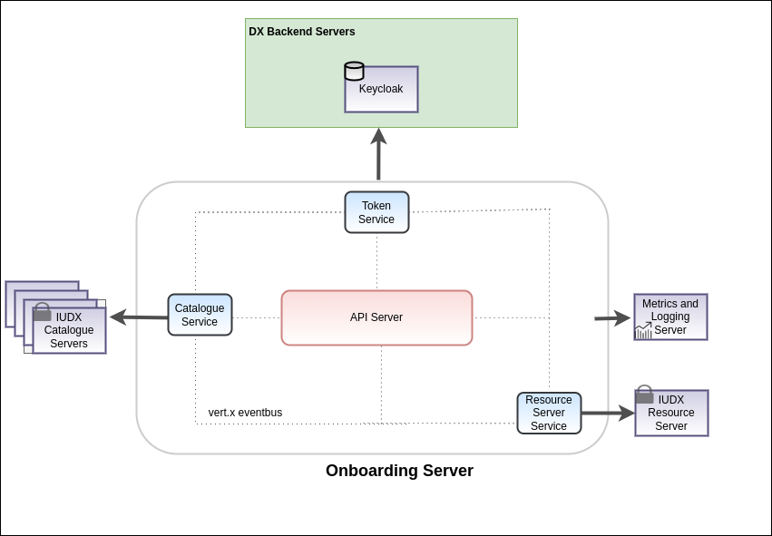

<div class="img_background">
<div style={{textAlign: 'center'}}>

<br/>

</div></div>
The onboarding server is IUDX's helper server for onboarding items, instances and middle layer metadata in a federated Catalogue server model.

### Installation

1. Navigate to the directory:

    ```bash
    cd iudx-deployment/Docker-Swarm-deployment/single-node/onboarding-server/
    ```

2. Assign the node label if not assigned during swarm installation using:

    The onboarding-server container is constrained to run on specific node by adding node labels to only one of the nodes, refer [here](https://docs.docker.com/engine/swarm/services/#placement-constraints) for more info. This ensures the container is placed always to same node on restart.

    ```bash
    docker node update --label-add onboarding-server-node=true <node_name>
    ``` 

3. Make a copy of sample secrets directory.

    ```bash
    cp -r example-secrets/secrets .
    ```

    1. Secrets directory after generation of secret files
    
    ```sh
    secrets/
    ├── config.json
    └── .onboarding.env
    ```

    2. Substitute appropriate values using commands whatever mentioned in config files. Configure the secrets/.onboarding.env file with appropriate values in the place holders `<...>`


4. Define Appropriate values of resources -

    - CPU 
    - RAM 
    - PID limit 
    in `onboarding-server-stack.resources.yaml` as shown in sample resource-values file for [here](example-onboarding-server-stack.resources.yaml)

5. Deploy onboarding server stack:

    ```sh
    docker stack deploy -c onboarding-server-stack.yaml -c onboarding-server-stack.resources.yaml onboarding-server
    ```

### Tests

The apis documentation will be available at  `https://<onboarding-server-domain-name>/apis`
### Notes

1. The upstream code for onboarding server is available at [here](https://github.com/datakaveri/iudx-onboarding-server).

2. If you need to expose the HTTP ports or have custom stack configuration( see [here](example-onboarding-server-stack.custom.yaml) for example configuration of 'onboarding-stack.custom.yaml' file)  and bring up like as follows.
```sh
docker stack deploy -c onboarding-server-stack.yaml -c onboarding-server-stack.resources.yaml -c onboarding-server-stack.custom.yaml onboarding-server
```