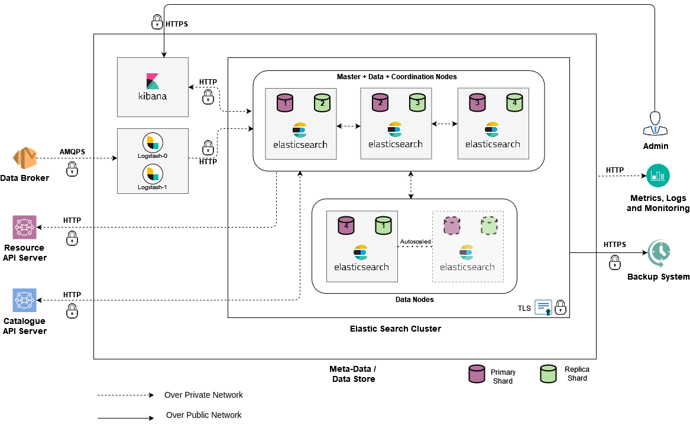

<div style={{textAlign: 'center'}}>


</div>

+ Deploys Elasticsearch, Logstash, and Kibana. 
+ Elasticsearch is used as a meta-data and data store. Logstash acts as the data pipeline between RabbitMQ and Elasticsearch. Kibana is used for visualization and management of the ELK stack.

### Prerequisite

RabbitMQ needs to be up for Logstash to connect.

### Installation

1. Navigate to the below directory:

    ```
    cd iudx-deployment/Docker-Swarm-deployment/single-node/elk/
    ```

2. Assign the node label if not assigned during swarm installation using:

    ```
    docker node update --label-add database_node=true <node_name>
    ```

3. Make a copy of the sample secrets directory by running the following command:

    ```
    cp -r example-secrets/secrets .
    ```

4. Generate the passwords:

    ```
    ./create-secrets.sh
    ```

5. For AWS-S3 Snapshot and Restore, define the `s3-access-key` and `s3-secret-key` in the file `secrets/passwords/snapshot-credentials.env` as shown below:

    ```env
    ELASTICSEARCH_KEYS=s3.client.default.access_key=<s3-access-key>,s3.client.default.secret_key=<s3-secret-key>
    ```
    

6. For Azure-Blob-Storage, define the `storage-account-name` and `storage-access-key` in `secrets/passwords/snapshot-credentials.env` as shown below:

    ```env
    ELASTICSEARCH_KEYS=azure.client.default.account=<storage_account_name>,azure.client.default.key=<access-key>
    ```

7. Generate keystores for Kibana and Logstash:

    ```
    ./generate-keystore.sh
    ```

8. Generate certs using below:

    ```
    ./generate-certs.sh
    ```

9. Define approriate domain for Kibana in `kibana/kibana.yaml`
   
   ```
    secrets/
    ├── keystores
    │   ├── kibana.keystore
    │   └── logstash.keystore
    ├── passwords
    │   ├── elasticsearch-cat-password
    │   ├── elasticsearch-fs-password
    │   ├── elasticsearch-rs-password
    │   ├── elasticsearch-su-password
    │   ├── es-password.env
    │   ├── kibana-admin-password
    │   ├── kibana-admin-username
    │   ├── kibana-system-password
    │   ├── logstash-internal-password
    │   ├── logstash-rabbitmq-password
    │   ├── logstash-rabbitmq-username
    │   ├── logstash-system-password
    │   └── snapshot-credentials.env
    └── pki
        ├── elastic-certificates.p12
        ├── elastic-stack-ca.p12
        ├── s3-access-key
        └── s3-secret-key
   ```


10. Deifine approriate domain for kibana in kibana/kibana.yaml

11. Define Appropriate values of resources in ‘database-stack.resources.yml’ as shown in the sample file **[example-database-stack.resources.yaml](https://github.com/datakaveri/iudx-deployment/blob/5.0.0/Docker-Swarm-deployment/single-node/elk/example-database-stack.resources.yaml)**

    + CPU requests and limits
    + RAM requests and limits
    + PID limit
    

12. Deploy ELK stack as follows:

    ```
    cp example-database-stack.resources.yaml database-stack.resources.yaml

    docker stack deploy -c database-stack.yaml -c database-stack.resources.yaml database
    ```

### Configuration

After elasticsearch is up, account generator needs to be deployed(only on clean deployment)

1.  Bring up the account generator stack (only on clean deployment): 

    ```
    docker stack deploy -c account-generator.yaml tmp
    ```

2.  Monitor logs to ensure creation:
    ```
    docker service logs tmp_account-generator -f
    ```

3. Remove the stack after successful account generator:
    ```
    docker stack rm tmp
    ```

### Tests

1. Create a Test Index
   1. Create a test index called `iudx__test-itms`. Refer [here](https://github.com/datakaveri/iudx-deployment/blob/5.0.0/K8s-deployment/Charts/elk/tests/create-index.txt) for the command.

2. RMQ-ELK Pipeline Test

    1. Test the publishing of messages to exchange and routing to queue through a Python script

       1. Create Python Virtual Environment
          ```
          # Create venv
          python3 -m venv ~/.venv/iudx-tests

          # Go into venv
          source ~/.venv/iudx-tests/bin/activate
          ```

       2. Install All Necessary Packages from `requirements.txt`
          ```
          pip install -r requirements.txt
          ```

       3. Configure Test Exchanges

          | VHOST | Exchange Name | Type of Exchange |
          |-------|---------------|------------------|
          | IUDX  | test-itms      | topic            |

       4. Configure Exchange-Queue Binding:

          | VHOST | Exchange   | Queue     | Routing   |
          |-------|------------|-----------|-----------|
          | IUDX  | test-itms  | database  | key       |
          | IUDX  | test-itms  | redis-latest | key     |

       5. Configure Parameters in the Python Script:
          ```
          username = ''
          password = ''
          host = ''
          # public AMQPS port 
          port = 
          ```

       6. Run the Python Scripts

       7. Refer **[here](https://github.com/datakaveri/iudx-deployment/tree/5.0.0/K8s-deployment/Charts/databroker/tests)** for more information.

    b. Test if the Messages have Reached Elasticsearch
       1. Use the count command in Kibana console->Management-> dev tools. The count should match the number of messages published.
         ```sql
         GET iudx__test-itms/_count
         ```

    c. Check for No Error Logs at Logstash during the Publication.

### Notes
 1. Kibana UI can be accessed from **https://< kibana-domain-name >** 
 2. Kibana is tls secured through centralised nginx.
 3. To check if the elk stacks are deployed and running: `docker stack ps database`
 4. For more information on installation instructions, refer **[here](https://github.com/datakaveri/iudx-deployment/tree/5.0.0/Docker-Swarm-deployment/single-node/elk)**.
