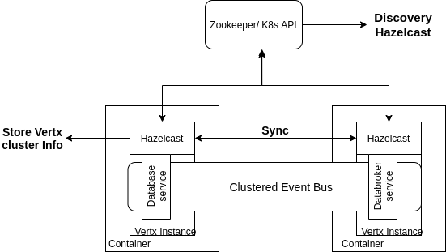

<div class="img_background">
<div style={{textAlign: 'center'}}>


</div>
</div>


+ ZooKeeper operates as a distributed file system and exposes a simple set of APIs that enable clients to read and write data to the file system.
+ Zookeeper performs service discovery of APIs using the data stored in Hazelcast cache.
+ Before running any API servers or monitoring stack, Zookeeper has to be running.

### Installation

1. Navigate to the below directory:

    ```
    cd iudx-deployment/Docker-Swarm-deployment/single-node/zookeeper/
    ```

2. Define appropriate values for resources in `zookeeper-stack.resources.yaml` as shown in the sample file **[example-zookeeper-stack.resources.yaml](https://github.com/datakaveri/iudx-deployment/blob/5.0.0/Docker-Swarm-deployment/single-node/zookeeper/example-zookeeper-stack.resources.yaml)**

    - CPU requests and limits
    - RAM requests and limits
    - PID limit

    

3. Deploy the Zookeeper stack as follows:

    ```
    cp example-zookeeper-stack.resources.yaml zookeeper-stack.resources.yaml

    docker stack deploy -c zookeeper-stack.yaml -c zookeeper-stack.resources.yaml zookeeper
    ```

### Notes

1. To check if the Zookeeper stacks are deployed and running: `docker stack ps zookeeper`
    

2. For more information on installation instructions, refer **[here](https://github.com/datakaveri/iudx-deployment/tree/5.0.0/Docker-Swarm-deployment/single-node/zookeeper#introduction)**.

