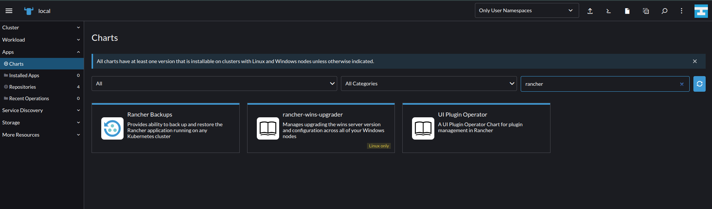

### Prerequisites

<details>
<summary><div class="style">creating IAM policies, roles, users and S3 buckets</div></summary>

1. Create IAM policies for:
   *  [rs-async](https://raw.githubusercontent.com/SRINI2410/iudx-developer-docs/kubernetes-depl-docs/docs/resources/AWS-IAM-POLICIES/iam-user-s3-bucket-policies/async_query_policy.json)
   *  [elasticSearch snapshot](https://raw.githubusercontent.com/SRINI2410/iudx-developer-docs/kubernetes-depl-docs/docs/resources/AWS-IAM-POLICIES/iam-user-s3-bucket-policies/Elasticsearch_snapshots_policy.json)
   *  [rancher backup](https://raw.githubusercontent.com/SRINI2410/iudx-developer-docs/kubernetes-depl-docs/docs/resources/AWS-IAM-POLICIES/iam-user-s3-bucket-policies/rancher_backup_policy.json)
   *  [etcd backup](https://raw.githubusercontent.com/SRINI2410/iudx-developer-docs/kubernetes-depl-docs/docs/resources/AWS-IAM-POLICIES/iam-user-s3-bucket-policies/etcd_backup_policy.json)
   *  [velero backup](https://raw.githubusercontent.com/SRINI2410/iudx-developer-docs/kubernetes-depl-docs/docs/resources/AWS-IAM-POLICIES/iam-user-s3-bucket-policies/velero_backup_policy.json)
   *  [worker node efs Policy](https://raw.githubusercontent.com/SRINI2410/iudx-developer-docs/kubernetes-depl-docs/docs/resources/AWS-IAM-POLICIES/EfsPolicy.json)
   *  [worker node Ebs Policy](https://raw.githubusercontent.com/SRINI2410/iudx-developer-docs/kubernetes-depl-docs/docs/resources/AWS-IAM-POLICIES/encryptedEbsVolumePolicy.json)
   *  [master node Policy](https://raw.githubusercontent.com/SRINI2410/iudx-developer-docs/kubernetes-depl-docs/docs/resources/AWS-IAM-POLICIES/masterNodeRole.json)
   *  [worker node Policy](https://raw.githubusercontent.com/SRINI2410/iudx-developer-docs/kubernetes-depl-docs/docs/resources/AWS-IAM-POLICIES/workerNodeRole.json)

2. Create IAM Roles for:
   * Master node (attach master node Policy)
   * Worker node (atatch worker node Policy)

3. Create IAM users and attach respective polices created above:
   * async query 
   * elasticSearch snapshot 
   * rancher backup 
   * etcd backup 
   * IAM veleroUser
   * IAM geoserver user 

4. Create S3 buckets:
   * rs-async query 
   * elasticsearch snapshot backup
   * rancher-backup
   * etcd-backup
   * velerobackup
   * geoserver data

5. Create EFS volume for performing resource server async query

</details>

<details>
<summary><div class="style">creating EIPs (elastic IPs) and DNS records</div></summary>

1. Create 3 Elastic IPs for
   * RKE2 cluster loadbalancer for Rancher HA(IP0)
   * NGINX Ingress(IP1)
   * and RMQ Loadbalancers respectively(IP2)

2. Create following DNS A records in your domain registrar  pointing to above created public IPs (IP0, IP1 and IP2) attached to LB

| Domain ( Example placeholder) | IP  | Comments                                                       |
| ----------------------------- | --- | -------------------------------------------------------------- |
| rancher-domain-name            | IP0 | To access Rancher                                              |
| kibana-domain-name             | IP1 | To access kibana UI                                            |
| databroker(rabbitmq)-domain-name   | IP2 | To access databroker UI                                        |
| grafana-domain-name      | IP1 | To access grafana UI                                           |
| keycloak-domain-name      | IP1 | To access keycloak Mgmt UI                                     |
| resource-server domain            | IP1 | Rs server public api endpoint                                  |
| cos/dx domain name       | IP1 | Cos/dx (cat, auth and onboarding under this domain) server public api endpoint |
| file-server api endpoint domain name          | IP1 | File  public api endpoint                                      |
| data ingestion domain name           | IP1 | Di server public api endpoint                                  |
| central catalogue domain name   | IP1 | Central catalogue api endpoint                                 |

</details>

<details>
<summary><div class="style">Setup Rancher server Infrastructure on AWS</div></summary>

#### Follow the below steps to setup rancher on AWS 
 1. Create a VPC 
 2. Create Subnet in created VPC
 3. Create Internet Gateway and Attach to the created VPC
 4. Create route table and associate with created subnet
      * Create a route in the route table with destination 0.0.0.0/0 and Target as the created gateway
 5.  Create a security group with the rules **[here](https://ranchermanager.docs.rancher.com/getting-started/installation-and-upgrade/installation-requirements/port-requirements#ports-for-rancher-server-nodes-on-rke2)**
 6. Create 3 instances for the Rancher HA (high availability) VMs with the following specificationss
      *  **AMI**: Ubuntu 22.04
      *  **Instance type**: m6a.large
      *  attach created security group
      *  **auto-assign public IP**: Enable
      *  use **gp3** volume
      *  unlimited credit specification
      *  **EBS-optimized instance**: Enable
 7. Create target groups for individual ports mentioned below 
      *  target type: Instances
      *  protocol: TCP
      *  ports
         * 80 
         * 443
         * 9345
         * 6443
      * health check 
         * Healthy, Unhealthy Threshold: 3
         * timeout: 6s
         * Interval: 10s
         * Override: 80 ( for port 443 only)
      * Register targets
         * add the 3 Rancher HA nodes created 
         * refer **[here](https://ranchermanager.docs.rancher.com/how-to-guides/new-user-guides/infrastructure-setup/amazon-elb-load-balancer#1-create-target-groups)** for more information.

 8. Create Network Load Balancer with the following options
      *  Internet Facing
      *  Add **listener** for 80, 443, 9345, and 6443 ports with forwarding to respective target group
      *  Use created EIP (IP0) as IPv4 address

 9. Create DNS mapping for the loadbalancer IP

</details>

<details>
<summary><div class="style">Install Rancher HA on RKE2 cluster</div></summary>

 **Prerequisites**:
 1. Install kubectl and helm cli from the script **[here](https://github.com/datakaveri/iudx-deployment/blob/5.0.0/K8s-deployment/K8s-cluster/misc-setup/cli-tools.sh)**. 

 2. Git clone datakaveri/iudx-deployment repo 
   ```
   git clone -b 5.0.0 https://github.com/datakaveri/iudx-deployment.git 

   ```
 3. Install certmanager in the cluster

**Installation**:
 1. Add rancher repo
   ```
   helm repo add rancher-stable https://releases.rancher.com/server-charts/stable
   ```
 2. Create cattle-system namespace
   ```
   kubectl create namespace cattle-system
   ```
 3. Install Rancher helm chart
   ```
   helm install rancher rancher-stable/rancher \
   --namespace cattle-system \
   --set hostname=rke2-rancher.iudx.org.in \
   --set bootstrapPassword=admin \
   --set ingress.tls.source=letsEncrypt \
   --set letsEncrypt.email=admin.cloud@datakaveri.org \
   --set letsEncrypt.ingress.class=nginx \
   --version 2.7.1
   ```

</details>

<details>
<summary><div class="style">Setup backup and restore for RKE2 cluster</div></summary>

1. Installing rancher backups operator:
   * Click on tribar (≡) present on top left corner in rancher desktop
   * Under "EXPLORE CLUSTER" elect **local** 
   * Select **app**⇒ **Charts**
      
   * Configure default storage location. Refer **[here](https://ranchermanager.docs.rancher.com/v2.6/reference-guides/backup-restore-configuration/storage-configuration)**
   * Click **Instal**
2. Create a secret in the local cluster with your S3 credentials ( Use credentials fo **rancher backup user** created in infrastructure setup section earlier) with keys and the directives accessKey and secretKey. It can be in any namespace. An example secret is **[here](https://ranchermanager.docs.rancher.com/v2.6/reference-guides/backup-restore-configuration/backup-configuration#example-credentialsecret)**.

3. Setting up a recurring backup
   * Click tribar (☰) on top left corner 
   * Select **local** under EXPLORE CLUSTER 
   * In the left navigation bar, Rancher Backups > Backups.
   * Create the Backup with the form
   * Select recurring backups with schedule `0 */6 * * *` ( customize as per your needs). Set retention count as 40. (This will retain 10 days of backups. Can be increased or reduced as per requirement.)
   * The backups can be stored unencrypted since the encryption will be enabled in the backups’ s3 bucket.
   * Fill the storage location details appropriately with the details of the s3 bucket created in previous steps.
   * Refer [here](https://ranchermanager.docs.rancher.com/v2.6/reference-guides/backup-restore-configuration/backup-configuration) for more details on backup configuration.

4. Restoring a Rancher Backup
   * Click tribar (☰) on top left corner 
   * Select **local** under EXPLORE CLUSTER 
   * In the left navigation bar, **Rancher Backups⇒ Restores**. Click **Create**.
   * Create the Restore with the form
   * Depending on the restore scenario, if the backup object is present in the cluster, select it as the target backup and create the restore.
   * Or you can restore from S3 by giving the credentials and details of the backup bucket and giving the latest backup file name in the bucket from the aws portal. 
   * Refer [here](https://ranchermanager.docs.rancher.com/v2.6/how-to-guides/new-user-guides/backup-restore-and-disaster-recovery/restore-rancher) for more details on restore configuration.

</details>

<details>
<summary><div class="style">Setup cloud credentials on Rancher</div></summary>

**Prerequisites**:
* Create a VPC/subnet for cluster resources.
* Create a security group with appropriate rules for rancher cluster (Optional. Rancher creates this for you if not created. It can be modified later as well.)

1. Click tribar (☰) and select Cluster Management.
2. Click Cloud Credentials.
3. Click Create.
4. Click Amazon.
5. Enter a name for the cloud credential.
6. In the Default Region field, select the AWS region where your cluster nodes will be located.
7. Enter your AWS EC2 Access Key and Secret Key of IAM rancher User created before in    Provisioning Infra section
8. Click Create.

**Result**: You have created the cloud credentials that will be used to provision nodes in your cluster. You can reuse these credentials for other node templates, or in other clusters.

</details>

<details>
<summary><div class="style">Creating rancher cluster</div></summary>

1. Click tribar (☰) and select Cluster Management.
2. On the Clusters page, click Create (top right corner)
3. Toggle the switch to **RKE2/K3s**.
4. Click Amazon EC2.
5. Select a Cloud Credential, if more than one exists. Otherwise, it's preselected.
6. Enter a Cluster Name.
7. Create a machine pool for each Kubernetes role. (Multiple for worker role to have different instance types)
      * For each machine pool, define the machine configuration/instance types, region, and zones
      * While creating master node and worker make sure to check below tabs,

      **Master**:
         - [x] `Etcd`
         - [x] `Control Plane`
         - [ ] `Worker`

      **Worker**:
         - [ ] `Etcd`
         - [ ] `Control Plane`
         - [x] `worker`

      * Pass the Master and Worker roles created in previous steps in the IAM instance Profile Name field in respective machine pools.
      * Select correct VPC/Subnet and Security group. (or let rancher create one for you)
      * Enable Allow access to EC2 metadata.

8. Use the Cluster Configuration to choose the version of Kubernetes that will be installed, what network provider will be used and if you want to enable project network isolation.
   * Tested with k8s version `v1.24.9+rke2r2`, Cloud Provider Amazon, Container Network `calico`.

9. Use Member Roles to configure user authorization for the cluster. Click Add Member to add users that can access the cluster. Use the Role drop-down to set permissions for each user.
10. Configure recurring etcd backup under **Cluster Configuration ** in **etcd**
      * Enable automatic snapshots with cron schedule `0 */6 * * *` and 40 retention (This will retain 10 days of backups. Can be increased or reduced as per the requirement.)
      * Configure the Backup snapshot to S3 by 
         * Creating s3 compatible authentication by selecting, **Cloud Credentials⇒Create⇒S3-Compatible** ( add Access key and Secretkey of etcdUser created earlier) 
11. Now click **Create** 

</details>

:::tip
Tag all the AWS resources brought up (make sure to match it with those tags of cluster nodes brought up by Rancher)
:::

***  

### Cluster Configuration

   #### Setting up K8s tools 

   Let's setup tools to interact with the cluster 

   1. Navigate to [iudx-deployment/K8s-deployment/K8s-cluster/misc-setup](https://github.com/datakaveri/iudx-deployment/tree/4.5.0/K8s-deployment/K8s-cluster/misc-setup)

    ```
    cd iudx-deployment/K8s-deployment/K8s-cluster/misc-setup
    ```

   2. Run the script ``cli-tools.sh`` in the machine from where you want to access K8s . This will install  kubectl and helm with auto completion of specified versions

   ```
   sudo ./cli-tools.sh v1.24.9
   ```

   
#### Overlay network testing of created cluster

1. Clone the below repo [here](https://github.com/datakaveri/iudx-deployment/tree/master/K8s-deployment/K8s-cluster/K8s/tests/network) to the server where rancher is running 

2. Before proceeding with the network test make sure the kube-config file is updated with proper contexts or
   * Follow these steps to set kube config file for your cluster:
      * Download `kubeconfig` file of the cluster created by selecting 
   
      **Cluster Management⇒cluster Name⇒︙⇒Download KubeConfig**
      * Try to connect with the cluster by running below command 

      ```
      kubectl --kubeconfig <kubeconfigfile> get pods
      ```
   * Once cluster connecting setup is done run below command 

      ```
      kubectl create -f network-test.yaml
      ```
   * To check the status

      ```
      kubectl rollout status ds/overlaytest -w
      ```

   * Now run `overlay-network-test.sh` script to check the network connectivity

      ```
      sudo ./overylay-network-test.sh
      ```


