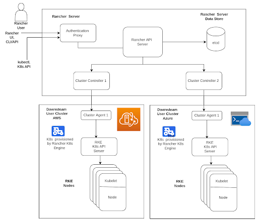
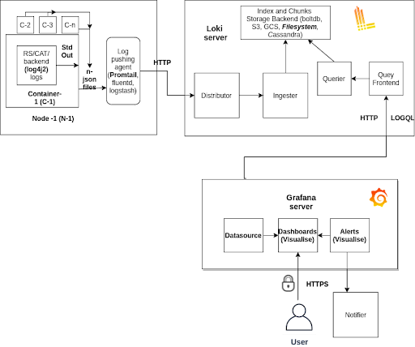

### Prerequisites

Linux node **(Standard_D4as v4 VM)** to run rancher server with docker env set up. Refer documentation **[here](https://docs.microsoft.com/en-us/azure/virtual-machines/linux/quick-create-portal)**.


### K8S Cluster Manager (Rancher) Installation


<div class="img_background">
<div style={{textAlign: 'center'}}>

<br/>
</div></div>

1. Clone the repository using the following command:  

    ```
    git clone -b 4.0.0  https://github.com/datakaveri/iudx-deployment
    ```

2. For installing docker ,Navigate to files directory:

    ```
    cd iudx-deployment/Docker-Swarm-deployment/single-node/infrastructure/files
    sudo ./packages-docker-install.sh
    ```

3. Navigate to the below rancher directory:
   
    ```
    cd iudx-deployment/K8s-deployment/K8s-cluster/Rancher
    ```

4. efine appropriate compose definitions in docker-compose.custom.yaml to override the base compose file(docker-compose.yaml).The definition can depend on where and for what purpose (test, production, machine specs) its deployed. An example is present for reference.


5. For rancher version 2.5.9 , exists a **[issue](https://github.com/rancher/rancher/issues/33360)**, need to execute following command before bringing up rancher : -

    ```
    sysctl -w net/netfilter/nf_conntrack_max=131072
    ```
6. Run Rancher server in docker using docker-compose: 

    ```
    docker-compose -f docker-compose.yaml -f docker-compose.custom.yaml up -d
    ```

Rancher UI will be available at **<rancher_server_url>:27083**


### Provisioning infrastructure on Azure

**Create Resource Group and Azure Active Directory (AAD) application for rancher to use to access the azure resources.**


    1. Create a resource group on Azure by following the guide here.
    2. Create an Azure AD application and service principal that can access resources by following the guide here. 
    3. Assign Contributor role to the application for the subscription that will be used to create the VMs
    4. Get the application's aadClientId and aadClientSecret (Will be required by rancher in cluster setup)

**Disclaimer:** 

The aadClientSecret is set to expire in 6 months by default (24 months max limit allowed). 
    
1. Before expiry, need to generate a new secret by following the steps mentioned here 
2. Update aadClientSecret in the Rancher cluster settings through edit as yaml way  as shown in snippet below(not through form based rancher cluster edit). This will result in cordoning of nodes and upgrading, one by one. Hence, may result in some disruption of IUDX workloads/servers.
    
    ``` 
    cloud_provider:
        azureCloudProvider:
        aad_client_cert_password: ''
        aad_client_id: ‘’
        aad_client_secret: ''”
    ```

3. Update in azure csi driver configs, redeploy the secret and restart csi controller, csi-azuredisk-node pods
4. Update in  cluster autoscaler and redeploy
5. Update Velero credentials configuration and redeploy velero


**Create a resource Plan of various IUDX components to provision necessary VM types - mainly** 

1. Rancher server  
2. Control plane nodes 
3. Worker nodes 

The resource plan for various IUDX components and the corresponding vm  is present **[here](https://docs.google.com/spreadsheets/d/1OQLVxeaQVu0W4GDeY7BMDj2kSCBcTh0oNgFFagbEKdQ/edit#gid=0)**. The planned resource along with instance type  (as node selector labels) values needs to be added in resource-values.yaml 

**Create a new kubernetes cluster on Rancher using the ‘Existing Nodes Option’**

1. Select Canal as the Network Provider
2. Select Azure (in-tree) as the Cloud Provider
    1. Fill in the aadClientId and aadClientSecret  generated in the previous step.
    2. Fill in the Azure subscriptionId and tenantId from azure.
    3. Set loadBalancerSku as Standard.
    4. Set the correct securityGroupName that will be used for the VMs. (Can be added/edited later if not been created)
    5. Set useInstanceMetadata as ‘true’.
    6. Set vmType as ‘vmss’.
    7. Rest of the settings can be left default.

3. In advanced options, 
    1. disable nginx-ingress 
    2. enable secrets encryption 
4. After saving, Rancher will provide a docker run command to add nodes to the cluster. Copy this command as it’ll be used in the next steps.

**Create VMs on azure for k8s Nodes. (under the same subscription as the aadApplication and same resource Group)**

1.  Create a Load Balancer by following the guide here.
    1. SKU of the Load Balancer should be the same as the SKU of VMSS, and keep both as ‘Standard’
    2. The name of the load balancer must be ‘kubernetes’ only.
    3. Create 2 public ips - one for lb in front of ingress (IP1) and for rmq lb (IP2)  and then attach those ips to the load balancer. 
        1. Create public ip , by going to Public IP ->Create 
        2. Configure the name and resourceGroup, subscription and create IP 
        3. Goto load balancer and add the created IP in frontend IP configuration
2. Create following DNS A records in your domain registrar  pointing to above created public IPs (IP1 and IP2)  attached to LB

| Domain                 | IP   | Comments                        |
|------------------------|------|--------------------------------|
| k8s-database.test      | IP1  | To access Kibana UI            |
| k8s-databroker.test    | IP2  | To access Databroker UI        |
| k8s-logmanager.test    | IP1  | To access Grafana UI           |
| k8s-keycloak.test      | IP1  | To access Keycloak Mgmt UI     |
| k8s-rs.test            | IP1  | RS server public API endpoint  |
| k8s-api.catalogue.test | IP1  | Cat server public API endpoint |
| k8s-authorization.test | IP1  | Auth server public API endpoint|
| k8s-gis.test           | IP1  | GIS server public API endpoint |
| k8s-file.test          | IP1  | RS server public API endpoint  |
| k8s-di.test            | IP1  | DI server public API endpoint  |


3. Create a Virtual Machine Scaling Set (VMSS) by following the guide here.
    
    1. If multiple VMSS are needed, make sure to name the VMSS beginning with a distinguishing name. To avoid having the same hostname. The hostname is of the form "{VMSS-name-prefix}{base-36-instance-id}". 
        1. This VMSS-name-prefix is the starting 9 digit string of the vmss name.
        2. VMSS-name-prefix can be customised if VMSS is provisioned from azure cli using the --computer-name-prefix flag. Refer to this doc for more.
    
    2. Select the resource group created in the last step.
    
    3. Select a Virtual network and Network interface.
    
    4. Edit the selected Network Interface
        1. Select Advanced option for NIC network security group.
            1. Select ‘Create new’ Network Security Group and add inbound rules according to the rancher k8s port requirements listed in the document here.
            2. If multiple VMSS are used, use the same security group for all.
        2. Set Public Address to enabled.
    
    5. Enable ‘use a load balancer’.
        1. Select ‘Azure Load Balancer’
        2. Then select the load balancer that was created in previous steps.
        3. Select or create a backendpool and use the same one for all VMSS.
    
    6. In the advanced tab add the init script in the custom data field from: iudx-deployment/K8s-deployment/K8s-cluster/Rancher/configs/azure. Use the correct one depending on the K8s node roles - worker/master.
        1. Replace the values in docker run command with the ones from the registration command obtained after the rancher cluster creation in the previous steps. Or it can be retrieved by going to your cluster page on rancher and selecting Registration Cmd from the 3 dot menu in the top right.
        2. Newer rancher versions do not provide a ca_checksum_value and the flag can be removed.   
    
    7. Add the following tags:-
        1. cluster-autoscaler-enabled: true
        2. cluster-autoscaler-name: **< rancher-cluster-name >**
        3. Add min and max tags for setting the minimum and maximum number of instances that the cluster autoscaler can scale to.
    
    8. Rest of the values can be adjusted as per need.


4. Creating a VMSs for master nodes is not required as it’s not being autoscaled. But it’s recommended, so that all the settings are consistent across all nodes.
5. Cluster autoscaling supports scaling based on the requested instance-type. So multiple worker node VMSS with different instance-types can be created to implement that.
6. Once created, active nodes will automatically be added to the Rancher cluster. (Atleast 1 master node is required for the cluster to be provisioned)
    

**Create Storage Containers and S3 bucket**
    
1. Create S3 bucket and IAM user for async query
    1. Follow the document available [here](link_to_s3_bucket_creation_document) to create an AWS S3 bucket.
    2. Create IAM User with Policy

Create an IAM user with the following policy:

```
{
    "Version": "2012-10-17",
    "Statement": [{
   		 "Action": [
   			 "s3:ListBucket",
   			 "s3:GetBucketLocation",
   			 "s3:ListBucketMultipartUploads",
   			 "s3:ListBucketVersions",
   			 "s3:ListBucketMultipartUploads"
   		 ],
   		 "Effect": "Allow",
   		 "Resource": [
   			 "arn:aws:s3:::<rs-async-bucket-name>"
   		 ]
   	 },
   	 {
   		 "Action": [
   			 "s3:GetObject",
   			 "s3:PutObject",
   			 "s3:DeleteObject",
   			 "s3:AbortMultipartUpload",
   			 "s3:ListMultipartUploadParts"
   		 ],
   		 "Effect": "Allow",
   		 "Resource": [
   			 "arn:aws:s3:::<rs-async-bucket-name>/*"
   		 ]
   	 }
    ]
}
```
2. Follow the document available here to create an AWS S3 bucketCreate S3 bucket and IAM user for Elasticsearch snapshots
    1. Follow the document available here to create an AWS S3 bucket
    2. Create an IAM user with the following policy:


```
{
    "Version": "2012-10-17",
    "Statement": [{
   		 "Action": [
   			 "s3:ListBucket",
   			 "s3:GetBucketLocation",
   			 "s3:ListBucketMultipartUploads",
   			 "s3:ListBucketVersions"
   		 ],
   		 "Effect": "Allow",
   		 "Resource": [
   			 "arn:aws:s3:::<elastic-bucket-name>"
   		 ]
   	 },
   	 {
   		 "Action": [
   			 "s3:GetObject",
   			 "s3:PutObject",
   			 "s3:DeleteObject",
   			 "s3:AbortMultipartUpload",
   			 "s3:ListMultipartUploadParts"
   		 ],
   		 "Effect": "Allow",
   		 "Resource": [
   			 "arn:aws:s3:::<elastic-bucket-name>/*"
   		 ]
   	 }
    ]
}
```
Create access keys for both IAM users for use in the installation steps of ResourceServer and ElasticSearch.


**Installing Addons in the Rancher Cluster**

1. Installing Cluster-autoscaler for VMSS

    1. Fill in the CA yaml at **[iudx-deployment/K8s-deployment/K8s-cluster/addons/cluster-autoscaler/azure/cluster-autoscaler-autodiscover.yaml](https://github.com/datakaveri/iudx-deployment/blob/master/K8s-deployment/K8s-cluster/addons/cluster-autoscaler/azure/cluster-autoscaler-autodiscover.yaml)** with appropriate Azure cloud details and the K8s cluster name in `--node-group-auto-discovery=label:cluster-autoscaler-enabled=true,cluster-autoscaler-name=<YOUR CLUSTER NAME>`.
    2. Deploy using `kubectl apply -f cluster-autoscaler-autodiscover.yaml`.

2. Installing NGINX Ingress Controller

    1. Navigate to the directory: **[iudx-deployment/K8s-deployment/K8s-cluster/addons/ingress-controller](https://github.com/datakaveri/iudx-deployment/tree/master/K8s-deployment/K8s-cluster/addons/ingress-controller)**.

    ```
    cd iudx-deployment/K8s-deployment/K8s-cluster/addons/ingress-controller
    ```
    2. Define resource values for Memcached and Ingress-Nginx in respective directories in the file `resource-values.yaml` as per the resource planning done in step 2.Please see the example of 'resource-values.yaml' for ingress-nginx, memcached present in their respective directories for reference for aws and azure 
    cloud. Add IP1 as loadBalancerIP in resource-values.yaml. 
    
    ```
    cp iudx-deployment/K8s-deployment/K8s-cluster/addons/ingress-controller/ingress-nginx/example-azure-resource-values.yaml iudx-deployment/K8s-deployment/K8s-cluster/addons/ingress-controller/ingress-nginx/resource-values.yaml
    ```
    
    3. It can be installed using the ./install.sh script.

    ```
    ./install.sh
    ```
    
    4. For more information refer the documentation **[here](https://github.com/datakaveri/iudx-deployment/tree/master/K8s-deployment/K8s-cluster/addons/ingress-controller#nginx-ingress-controller)**.

3. Installing Velero for persistent volume backup :

     A guide for bringing up a velero on azure can be found **[here](https://github.com/datakaveri/iudx-deployment/tree/master/K8s-deployment/K8s-cluster/addons/ingress-controller#nginx-ingress-controller)**.

4. Installing Certmanager:

    1. To install certmanager, Navigate to the below directory
    
        ```
        cd iudx-deployment/K8s-deployment/K8s-cluster/addons/Certmanager
        ```
    2. make a copy of resource-value using the below command
        ```
        cd iudx-deployment/K8s-deployment/K8s-cluster/addons/Certmanager
        cp example-resource-values.yaml resource-values.yaml
        ```

    3. Define resource values for certmanager in the file `resource-values.yaml`. An example is given in example-resource-values.yaml.

    4. Add the Jetstack Helm repository and Update using:
        
        ```
        helm repo add jetstack https://charts.jetstack.io && helm repo update
        ```
    5. Create namespace for cert-manager using: kubectl create namespace cert-manager

        ```
        kubectl create namespace cert-manager
        ```
    6. Install cert-manager with crd using: helm install -f cert-manager-values.yaml -f resource-values.yaml  cert-manager jetstack/cert-manager -n cert-manager  --version  v1.6.1 --set installCRDs=true
        
        ```
        helm install -f cert-manager-values.yaml -f resource-values.yaml  cert-manager jetstack/cert-manager -n cert-manager  --version  v1.6.1 --set installCRDs=true
        ```
    7. For more information refer the documentation **[here](https://cert-manager.io/docs/installation/helm/#installing-with-helm)**.
    8. To deploy cert-manager issuer [Currently deploys LetsEncrypt issuer ]:

        1. Define the appropriate email-id required for letsencrypt issuer.
        2. Deploy the issuers using: kubectl apply -f cert-manager-cluster-issuer.yaml
            ```
            kubectl apply -f cert-manager-cluster-issuer.yaml
            ```
        3. This will deploy both staging and production LetsEncrypt issuers.

5. Installing csi drivers and creating storage-classes
    
    1. Navigate to the below directory:
        ```
        cd iudx-deployment/K8s-deployment/K8s-cluster/addons/storage/azure
        ```

    2. For AzureDisk 
        
        1. Follow the document **[here](https://github.com/datakaveri/iudx-deployment/tree/master/K8s-deployment/K8s-cluster/addons/storage/azure#deployment-with-azuredisk-csi-drivers)** for installing azureDisk csi drivers [refer here to check driver version compatibility with K8s]
        2. Create storage class yaml file **[azuredisk-storage-class.yaml](https://github.com/kubernetes-sigs/azuredisk-csi-driver#v1)** with provisioner as disk.csi.azure.com
        3. Following command will deploy the storageclass kubectl apply -f azuredisk-storage-class.yaml
            ```
            kubectl apply -f azuredisk-storage-class.yaml
            ```
    
    3. For AzureFile
        
        1. Follow the document here for installing azureFile csi drivers [Need to test csi drivers for azureFile and create an installation guide. Currently using in-tree k8s drivers for azureFile in the test clusters]
        2. Create a storage account on azure for the shared file system. By following the documentation here.
        3. Update the azurefile-storageclass.yaml with the created storage account name.
        4. Following command will deploy the storageclass kubectl apply -f azurefile-storage-class.yaml [Currently deploys the storage class that uses the k8s in-tree drivers for provisioning the volumes]
            ```
            kubectl apply -f azurefile-storage-class.yaml 
            ```

<div class="img_background">
<div style={{textAlign: 'center'}}>

<br/>
</div></div>


6. Installing mon-stack

    1. Navigate to the below directory
        ```
        cd iudx-deployment/K8s-deployment/K8s-cluster/addons/mon-stack
        ```
    2. Make a copy of sample secrets directory.
        ```
        cp -r example-secrets/secrets .
        ```

    3. Run the create_secrets.sh script to generate the admin username and password in the secrets/ directory
        ```
        > ./create_secrets.sh
        ```

    4. Config Telegrambot for grafana's alerts is detailed here. Then appropriately define the environment file secrets/grafana-env-secret. The template is defined as follow: Please do not include comments and substitute appropiate correct values in the placeholders `< placholder `>`.

        ```
        GF_SERVER_ROOT_URL=https://<grafana-domain-name>/
        GF_SERVER_DOMAIN=<grafana-domain-name>
        TELEGRAM_CHAT_ID=< telegram-chat-id>
        TELEGRAM_BOT_TOKEN=<telegram-chat-token>
        ```
    5. secrets directory after generation of secrets

        ```
        secrets/
        ├── admin-password (to set grafana admin Password)
        ├── admin-user    ( To set grafana admin username)
        ├── grafana-env-secret (Refer below for env vars to be set)
        ```
    6. Define Appropriate values of resources in cert-manager issuer and ingress hostname in grafana/resource-values.yaml
         
        - CPU of requests and limits
        - RAM of requests and limits
        - nodeSelector
        - Storage class name
        
        in grafana/resource-values.yaml, loki/resource-values.yaml, prometheus/resource-values.yaml and promtail/resource-values.yaml as shown in sample resource-values files present in the **[grafana/,loki](https://github.com/datakaveri/iudx-deployment/blob/3.5.0/K8s-deployment/K8s-cluster/addons/mon-stack/grafana)**, **[rometheus/](https://github.com/datakaveri/iudx-deployment/blob/3.5.0/K8s-deployment/K8s-cluster/addons/mon-stack/prometheus)**, and **[promtail/](https://github.com/datakaveri/iudx-deployment/blob/3.5.0/K8s-deployment/K8s-cluster/addons/mon-stack/promtail)** directories respectively.

    7. Run the install.sh script. This will install the whole mon-stack: prometheus, grafana, loki, and promtail.

        ```
        ./install.sh
        ```
- Grafana will be accessible at **https://< grafana-hostname >**
- To see status of helm : 
    ```
    helm ls -n mon-stack
    ```
- To see if all pods are deployed and running:
    ```
    kubectl get pods -n mon-stack
    ```
- For more information on installation instructions, refer **[here](https://github.com/datakaveri/iudx-deployment/tree/master/K8s-deployment/K8s-cluster/addons/mon-stack)**.